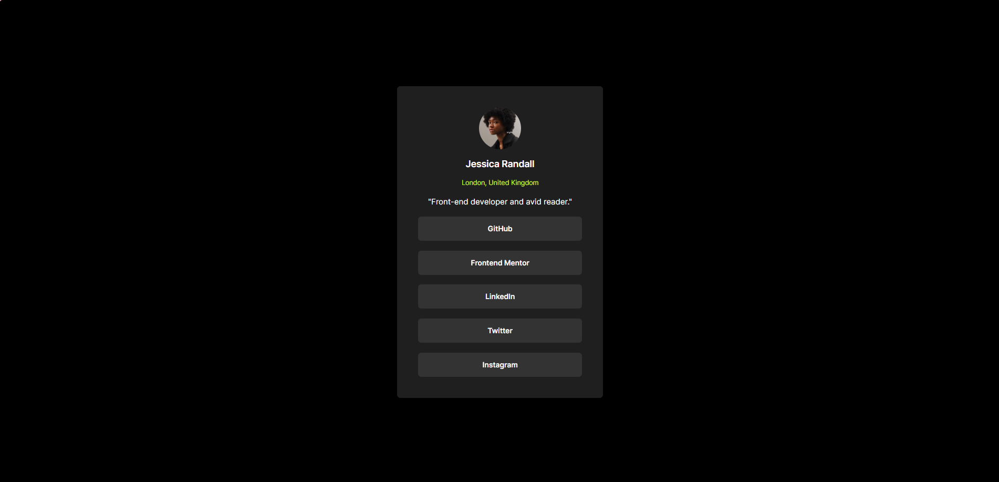
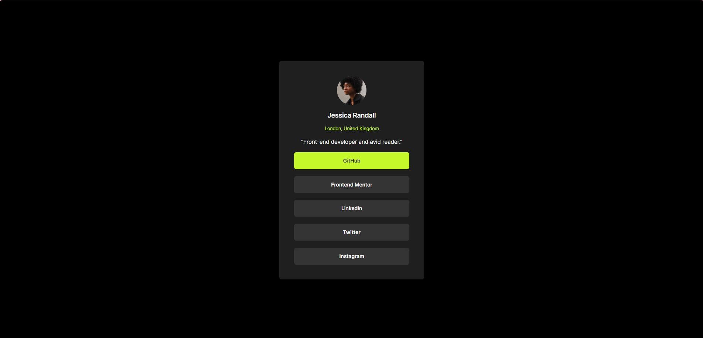
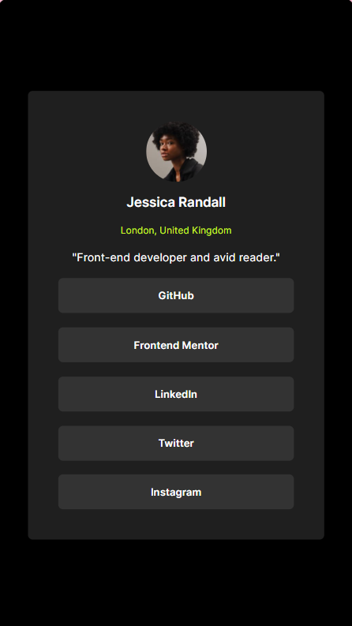

# Frontend Mentor - Social links profile solution

This is a solution to the [Social Links Profile challenge on Frontend Mentor](https://www.frontendmentor.io/challenges/social-links-profile-UG32l9m6dQ/hub). Frontend Mentor challenges help you improve your coding skills by building realistic projects. This project focuses on the HTML fundamental structures and the box model.

## Table of contents

- [Overview](#overview)
  - [Screenshot](#screenshot)
  - [Links](#links)
- [My process](#my-process)
  - [Built with](#built-with)

**Note: Delete this note and update the table of contents based on what sections you keep.**

## Overview

### Screenshot

### Links

- Solution URL: [Add solution URL here](https://github.com/ajasmine94/social-link-profile)
- Live Site URL: [Add live site URL here](https://social-link-preview-1025.netlify.app/)

## My process

- Built the HTML structure
- Style with CSS Flexbox
- Researched on importing truetype fonts
- Researched more on CSS Flexbox

### Built with

- Semantic HTML5 markup
- CSS custom properties
- CSS Flexbox
